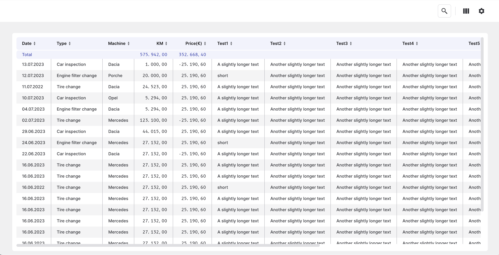

# VueJS3 Table

An easy to use, clean and powerful data table for VueJS3 with essential features like sorting, column searching, infinity scroll and much more.

Here's an example of how you can use it:
```
<table-controls></table-controls>

<table-data :data="{
    "header": [
        {"key": "date", "label": "Date", "searchable": false},
        {"key": "details", "label": "Details", "searchable": true},
        {"key": "status", "label": "User status", "searchable": true},
    ],
    
    "rows": [
        {"date": "10.11.2023", "details": "Some details", "status": "Active"},
        {"date": "27.12.2023", "details": "Details", "status": "Inactive"},
        {"date": "20.10.2023", "details": "Some details", "status": "Deleted"},
        {"date": "22.05.1997", "details": "New details", "status": "Active"},
    ],
}"
></table-data>
```

Here's an example of how you can use it:


## Installing
You can install the package via npm:

```
npm i vue3-table-data
```

or yarn:
```
yarn add vue3-table-data
```

Next, you must register the component. The most common use case is to do that globally(in your app.js or similar file)
```
import Vue from 'vue';
import { TableData, TableControls } from 'vue3-table-data';

Vue.component('v-table', TableData);
Vue.component('v-table-controls', TableControls);
```

Import into your component
```
import { TableData } from 'vue3-table-data';
import { TableControls } from 'vue3-table-data';

// add to component
components: {
    TableData,
    TableControls
}
```

Import style globally(in your app.scss or similar file) or rewrite it but don't forget to respect the structure.
```
@import "vue3-table-data/src/styles/_all.css";
```

You can import the files separately and rewrite part of the design because they are structured by components
```
@import "vue3-table-data/src/styles/_table.css";
@import "vue3-table-data/src/styles/_modal.css";
@import "vue3-table-data/src/styles/_form.css";
@import "vue3-table-data/src/styles/_buttons.css";
```

## Translate
You can translate the table texts into your language. We have a file with all the texts in English, but you can translate them into your language. 
You have to respect the structure of the file and the keys(you can find them in the translate.json file)
```
__vue3TableDataConfig.translation.setTranslate(translate);
```

## Features
- `Sort column`: The sort functionality allows sorting for each column. You can see in the example below


- `Search`: The search functionality allows searching in each column. You can see in the example below


- `Column filters and orders`: You can choose which columns you want to see and the order in which you want to see them


- `Table style`: You can change the size of the cells and the style of the numbers. Numbers can be colored green when they are positive and colored red when they are negative


## Dynamic slots
You can customize a cell using dynamic slots like this:
```
<table-data :data="{
    "header": [
        {"key": "date", "label": "Date", "searchable": false},
        {"key": "details", "label": "Details", "searchable": true},
        {"key": "status", "label": "User status", "searchable": true},
    ],
    
    "rows": [
        {"date": "10.11.2023", "details": "Some details", "status": "Active"},
        {"date": "27.12.2023", "details": "Details", "status": "Inactive"},
        {"date": "20.10.2023", "details": "Some details", "status": "Deleted"},
        {"date": "22.05.1997", "details": "New details", "status": "Active"},
    ],
}"
>
    <template #cell(date)="{ value }">
        <p>the date it's {{ value }}</p>
    </template>
</table-data>
```
You can have access to `value`, `column`, `row` and `helpers` that contains some helpers funcions like `formatNumericValue` and much more!
## Authors
- **[MRazvan2205](https://github.com/MRazvan2205)**